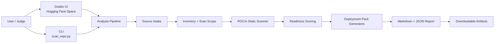
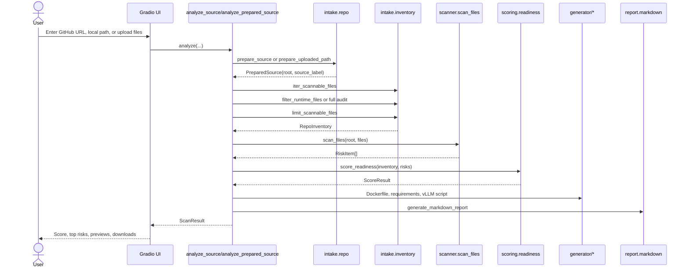

# MI300X Launch Doctor Architecture

This document describes the runtime architecture, data flow, module boundaries, reliability choices, and extension points for MI300X Launch Doctor.

MI300X Launch Doctor is not a CUDA-to-ROCm translator. It is a deployment readiness system that helps teams decide whether an AI workload can run on AMD, what must change, and how to validate it.

## 1. Product Goal

MI300X Launch Doctor turns a repository or uploaded project bundle into an AMD ROCm deployment-readiness package:

```text
Input project
  -> repo/file intake
  -> scoped inventory
  -> deterministic ROCm risk scan
  -> readiness score
  -> generated deployment artifacts
  -> benchmark status
  -> Markdown and JSON report
```

The MVP is designed for a hackathon submission where reliability matters more than speculative automation. The scanner is deterministic, fast, explainable, and independent of live LLM inference.

## 2. System Context



Primary deployment surfaces:

- Local demo: `python app.py`
- CLI validation: `python scan_repo.py <source> --out generated/<case>`
- Hugging Face Space: `https://huggingface.co/spaces/jay171/mi300x-launch-doctor`
- Live app: `https://jay171-mi300x-launch-doctor.hf.space/`

## 3. High-Level Runtime Flow



## 4. Entrypoints

### 4.1 Gradio UI

File: `app.py`

The UI is the judging path. It is intentionally simple:

- repository URL or local path text input
- multiple file upload, including zip bundles
- optional benchmark JSON upload
- scan mode radio
- analyze button
- score markdown
- top deployment blockers table
- report preview
- generated file previews
- downloadable deployment pack

The UI catches exceptions and returns a human-readable analysis error instead of exposing stack traces.

### 4.2 CLI

File: `scan_repo.py`

The CLI is the repeatable engineering validation path:

```bash
python scan_repo.py fixtures/cuda_risk_repo --out generated/cuda_risk
python scan_repo.py https://github.com/gradio-app/gradio --scan-mode runtime --out generated/gradio
python scan_repo.py https://github.com/huggingface/transformers --scan-mode full --out generated/transformers_full
```

It uses the same pipeline as the UI, so CLI and Space behavior stay aligned.

## 5. Core Package Map

```text
mi300x_launch_doctor/
  benchmark/
    results.py              sample vs real benchmark JSON loading
  generator/
    dockerfile.py           Dockerfile.rocm generator
    requirements.py         requirements-rocm.txt generator
    vllm_script.py          run_vllm_amd.sh generator
  intake/
    repo.py                 GitHub/local/upload intake and cleanup
    inventory.py            file discovery, scan modes, stress limits
  report/
    markdown.py             AMD_DEPLOYMENT_REPORT.md renderer
  scanner/
    rules.py                deterministic risk rule catalog
    scan_files.py           line-oriented text scanner
  scoring/
    readiness.py            score calculation, labels, penalty caps
  pipeline.py               orchestration layer
  schemas.py                shared dataclasses and JSON output models
```

## 6. Shared Data Model

File: `mi300x_launch_doctor/schemas.py`

The app avoids ad hoc dictionaries between modules. The pipeline passes typed dataclasses:

| Schema | Role |
| --- | --- |
| `RiskItem` | One detected compatibility finding with severity, category, file, line, evidence, explanation, recommendation, and rule id. |
| `RepoInventory` | Project metadata: source, scan scope, files scanned, discovered files, important files, languages, frameworks, and deployment signals. |
| `ScoreResult` | Numeric readiness score, label, bonus reasons, and penalty summary. |
| `BenchmarkResult` | Real or sample benchmark status and performance metrics. |
| `GeneratedFile` | Named artifact with content and write helper. |
| `ScanResult` | Complete analysis bundle returned by the pipeline and serialized to `scan_result.json`. |

This model is used by the CLI, UI, report generator, and artifact writer.

## 7. Intake Architecture

File: `mi300x_launch_doctor/intake/repo.py`

Supported sources:

- local folder path
- public GitHub repository URL
- uploaded zip file
- uploaded individual files

GitHub intake behavior:

1. Normalize supported GitHub URL shapes, including `.git`, trailing slash, `tree/...`, `blob/...`, and query strings.
2. Try shallow clone:

   ```bash
   git clone --depth 1 <repo>
   ```

3. If clone fails, fall back to GitHub zipball download.
4. Return a prepared temporary root.
5. Clean temporary sources after the analysis completes.

This design keeps the UI resilient on Hugging Face Spaces, where subprocess or network behavior can vary.

Bad inputs are treated as user-facing errors:

- empty input falls back to the built-in sample repo
- malformed URLs return a clear analysis error
- unsupported non-GitHub URLs return a clear analysis error
- missing local paths return a clear analysis error

## 8. File Inventory and Scan Scope

File: `mi300x_launch_doctor/intake/inventory.py`

The inventory layer has three responsibilities:

1. discover text files that are safe and useful to scan
2. select runtime-focused or full-audit scope
3. apply stress limits for large repositories

### 8.1 Scannable Files

The scanner accepts deployment-relevant text files:

- Python: `.py`
- native/CUDA-like code: `.cu`, `.cpp`, `.cc`, `.cxx`, `.c`, `.h`, `.hpp`
- dependency/config files: `.txt`, `.toml`, `.cfg`, `.ini`, `.yaml`, `.yml`, `.json`
- shell files: `.sh`
- Markdown and Dockerfiles

It skips:

- `.git`
- Python caches
- virtual environments
- `node_modules`
- build/dist folders
- generated output
- model/checkpoint directories
- files larger than 1 MB

### 8.2 Runtime Deployment Scan

Runtime deployment scan is the default and preferred judging mode. It reduces documentation and example noise by focusing on files that are likely to affect deployment:

- root dependency files
- Dockerfile and Docker Compose files
- root app/server/inference files
- runtime source directories such as `src`, `app`, `server`, `modules`, `comfy`, `ldm`, `extensions`, and `llamafactory`
- `.github/workflows` as CI/runtime risk context
- root README context

This mode is best for:

- hackathon demo
- realistic deployment readiness
- medium or large repositories
- reducing false impressions from docs-only CUDA mentions

### 8.3 Full Repository Audit

Full repository audit scans every scannable file in scope. It is useful for:

- migration discovery
- engineering review
- finding CUDA assumptions in docs, examples, tests, and CI
- stress testing large repositories

### 8.4 Stress Limits

Large repositories can contain thousands of docs, tests, examples, and generated files. The inventory layer keeps scans bounded:

| Limit | Value |
| --- | --- |
| Maximum file size | 1 MB |
| Maximum scanned files | 3000 |
| Maximum inventory text | 5 MB |
| Maximum inventory text per file | 25 KB |

If a repo exceeds the scan cap, deployment-critical files are prioritized first:

1. dependency metadata
2. Docker files
3. app/server/inference entrypoints
4. runtime source directories
5. GitHub workflows
6. root README
7. other text files

The report records files discovered, files scanned, and files omitted by the stress limit.

## 9. Scanner Architecture

Files:

- `mi300x_launch_doctor/scanner/rules.py`
- `mi300x_launch_doctor/scanner/scan_files.py`

The scanner is deterministic and line-oriented:

1. read each selected text file with UTF-8 fallback behavior
2. evaluate each rule against each line
3. emit a `RiskItem` with severity, category, file, line, evidence, explanation, recommendation, and rule id

The MVP deliberately does not use AST parsing or LLM interpretation. The benefits are:

- predictable results
- fast execution
- explainable evidence
- low dependency surface
- stable Hugging Face Space demo

Rule families:

| Family | Examples | Reason |
| --- | --- | --- |
| Docker base image | `nvidia/cuda` | Indicates CUDA-specific container base. |
| Docker runtime | `--gpus all` | Indicates NVIDIA container runtime assumptions. |
| CUDA APIs | `torch.cuda`, `.cuda()` | Hardcoded CUDA device path. |
| Environment config | `CUDA_VISIBLE_DEVICES` | CUDA-specific runtime environment. |
| System commands | `nvidia-smi` | NVIDIA-specific monitoring or health check. |
| Dependencies | `cupy-cuda`, `tensorflow-gpu` | CUDA-specific dependency names. |
| Quantization | `bitsandbytes` | Often assumes CUDA backend paths. |
| Kernel libraries | `flash-attn`, `xformers`, `triton` | Must be validated for ROCm compatibility. |
| Native CUDA | `cudaMalloc`, `cudaMemcpy`, CUDA launch syntax | Requires HIP/ROCm migration work. |
| Inference engine | `vllm` | Positive direction, but should use ROCm-compatible image. |

Findings are intentionally preserved even when they are repeated, because engineers need line-level evidence. Score impact is capped separately.

## 10. Readiness Scoring

File: `mi300x_launch_doctor/scoring/readiness.py`

The score starts at 100.

Risk penalties:

| Severity | Penalty |
| --- | --- |
| High | -15 |
| Medium | -8 |
| Low | -3 |

Repeated rule cap:

- each unique rule can penalize at most 3 times
- all findings still appear in the report and `scan_result.json`

This avoids cases where a large repository drops to 0 only because the same docs pattern appears hundreds of times.

Bonuses:

- Dockerfile or Docker Compose present: +5
- dependency metadata present: +5
- PyTorch detected: +5
- inference or serving entrypoint detected: +5
- no high-severity CUDA-only dependency found: +5

Labels:

| Score | Label |
| --- | --- |
| 85-100 | Ready for AMD deployment |
| 70-84 | Mostly ready |
| 50-69 | Needs migration work |
| 0-49 | High migration risk |

## 11. Deployment Pack Generation

Files:

- `mi300x_launch_doctor/generator/dockerfile.py`
- `mi300x_launch_doctor/generator/requirements.py`
- `mi300x_launch_doctor/generator/vllm_script.py`

Every successful scan generates:

```text
Dockerfile.rocm
requirements-rocm.txt
run_vllm_amd.sh
AMD_DEPLOYMENT_REPORT.md
scan_result.json
```

### 11.1 Dockerfile.rocm

The generated Dockerfile starts from:

```dockerfile
FROM rocm/pytorch:latest
```

It is meant as a practical starting point, not a production-pinned artifact. The report and generated file note that production deployments should pin tested ROCm/PyTorch versions.

### 11.2 requirements-rocm.txt

The requirements generator preserves safe-looking dependencies and comments CUDA-risk packages with migration notes. This makes the generated file editable rather than silently dropping risky dependencies.

Example:

```text
# bitsandbytes==0.43.1
# ROCm note: Validate ROCm quantization support or replace backend.
```

### 11.3 run_vllm_amd.sh

The generated script follows the recommended inference path:

```text
Recommended inference path: vLLM on ROCm Docker
```

It uses:

- `vllm/vllm-openai-rocm:latest`
- `/dev/kfd`
- `/dev/dri`
- `--group-add video`
- `--ipc=host`
- `--shm-size 8G`
- `bfloat16`
- default model: `Qwen/Qwen3.5-0.8B`
- default max model length: `32768`

The default Qwen target is intentionally a deployment validation target, not a dependency of the scanner itself.

## 12. Benchmark Architecture

File: `mi300x_launch_doctor/benchmark/results.py`

The benchmark subsystem has two modes:

| Mode | UI/report label | Behavior |
| --- | --- | --- |
| Sample | `Sample / Expected Format` | Used when no real benchmark JSON is provided. Clearly includes a disclaimer. |
| Real | `Real Run` | Used when the user uploads real benchmark JSON. |

Example real benchmark JSON:

```json
{
  "benchmark_mode": "real",
  "model": "Qwen/Qwen3.5-0.8B",
  "backend": "vLLM ROCm",
  "gpu": "AMD Instinct MI300X",
  "load_success": true,
  "avg_latency_ms": 742,
  "p50_latency_ms": 690,
  "p95_latency_ms": 1103,
  "tokens_per_second": 68.4,
  "memory_used_gb": 18.2
}
```

The public Space does not run live MI300X benchmarks. That is a deliberate MVP boundary. It keeps the demo stable while still supporting real AMD Developer Cloud benchmark output when available.

## 13. Report Architecture

File: `mi300x_launch_doctor/report/markdown.py`

The Markdown report is designed for two audiences:

1. engineering teams who need file/line evidence
2. judges or managers who need a fast executive summary

Report sections include:

- summary and score
- scan scope
- detected stack
- repository inventory
- major deployment blockers
- additional audit context
- recommended fixes
- generated files
- benchmark status
- vLLM/Qwen deployment path
- stress-limit metadata

The UI shows only the top deployment blockers. The full structured record is stored in `scan_result.json`.

## 14. UI Presentation Architecture

The UI intentionally separates:

- score summary
- top deployment blockers
- generated report
- generated deployment file previews
- downloadable artifact pack

Risk sorting prioritizes:

1. severity: high, then medium, then low
2. deployment-critical categories: Docker, dependencies, native CUDA, CUDA APIs, hardcoded devices, runtime, system commands, inference validation
3. file path and line number

This keeps the judging path focused on the issues that matter most for deployment.

## 15. Hugging Face Space Deployment

Hugging Face Space deployment uses:

- `README.md` YAML metadata
- `sdk: gradio`
- `sdk_version: 6.14.0`
- `app_file: app.py`
- `requirements.txt`

The Space can run without GPU because the scanner, report generator, and artifact generator do not require live inference.

The generated vLLM script is for the user's AMD ROCm environment, such as AMD Developer Cloud or another MI300X-capable host.

## 16. Security and Privacy Boundaries

The MVP is a public hackathon tool. It is designed for public repos and user-provided uploads, not private enterprise code.

Current boundaries:

- no private repo OAuth
- no persistent user accounts
- no database
- no automatic PR creation
- no remote code execution from scanned repos
- static text scanning only
- uploaded files are copied into temporary local folders for analysis
- generated output is written to temporary folders in the UI path

Operational guidance:

- do not upload secrets
- use public demo repos or sanitized internal repos
- review generated Dockerfiles and requirements before production use
- pin ROCm, PyTorch, vLLM, and model versions for production

## 17. Reliability and Stress-Test Strategy

The project is hardened around the expected judging path:

- built-in sample repo if input is blank
- clear error messages for bad URLs and missing paths
- GitHub zipball fallback if shallow clone fails
- runtime scan mode to reduce docs noise
- full audit mode for deeper review
- file size cap
- scan file cap
- inventory text cap
- prioritized file selection under large-repo pressure
- top-10 blocker display in UI
- full JSON artifact for detailed review

Recommended stress cases:

| Case | Purpose |
| --- | --- |
| `fixtures/cuda_risk_repo` | Demonstrate high-risk CUDA-first project. |
| `fixtures/mostly_ready_repo` | Demonstrate high readiness and low false positives. |
| `https://github.com/gradio-app/gradio` | Medium public repo, non-GPU app behavior. |
| `https://github.com/vllm-project/vllm` | Inference-framework repo. |
| `https://github.com/huggingface/transformers` | Large AI framework stress test. |
| malformed URL | Error handling. |
| nonexistent GitHub repo | Clone/zip fallback and user-facing failure. |
| uploaded zip | HF Space upload path. |
| real benchmark JSON | Sample-to-real benchmark mode switch. |

## 18. Testing Architecture

Tests live in `tests/`.

Coverage areas:

- scanner rule detection
- scoring labels and penalty caps
- generator output contents
- report rendering
- benchmark sample vs real mode
- runtime vs full scan mode
- pipeline integration
- UI error handling

Run:

```bash
python -m pytest
```

The current expected suite result is:

```text
18 passed
```

## 19. Extension Points

The architecture leaves room for future work without changing the core pipeline contract.

Potential extensions:

- AST-based Python device analysis
- HIP/CUDA C++ migration hints
- LLM report polishing after deterministic scan
- real AMD Developer Cloud benchmark runner
- private GitHub repo auth
- GitHub PR patch generation
- SARIF export for CI integration
- PDF report export
- multiple-repo comparison dashboard
- richer dependency compatibility database
- Qwen-powered natural language remediation assistant

Recommended extension pattern:

1. keep deterministic scanner output as source of truth
2. add optional intelligence layers after `ScanResult`
3. never make the public demo depend on live inference or GPU access
4. preserve `scan_result.json` compatibility where possible

## 20. Operational Checklist

Before submission or demo:

```bash
python -m pytest
python scan_repo.py fixtures/cuda_risk_repo --out generated/cuda_risk
python scan_repo.py fixtures/mostly_ready_repo --out generated/mostly_ready
python scan_repo.py https://github.com/gradio-app/gradio --scan-mode runtime --out generated/gradio_runtime
python app.py
```

Manual UI checks:

- app loads
- sample repo works
- CUDA-risk fixture shows low score and blockers
- mostly-ready fixture shows high score
- generated file previews render
- downloads include all five artifacts
- benchmark label says `Sample / Expected Format` unless real JSON is uploaded
- bad input shows a clear error and the UI remains usable

## 21. Design Principle

The system is intentionally conservative:

- deterministic first
- static analysis before LLM interpretation
- runtime deployment scan before full repository audit
- honest benchmark labeling
- generated files that are editable and reviewable
- one pipeline shared by CLI and UI

That makes MI300X Launch Doctor suitable for the hackathon judging path and useful as a starting point for a real AMD ROCm migration workflow.
